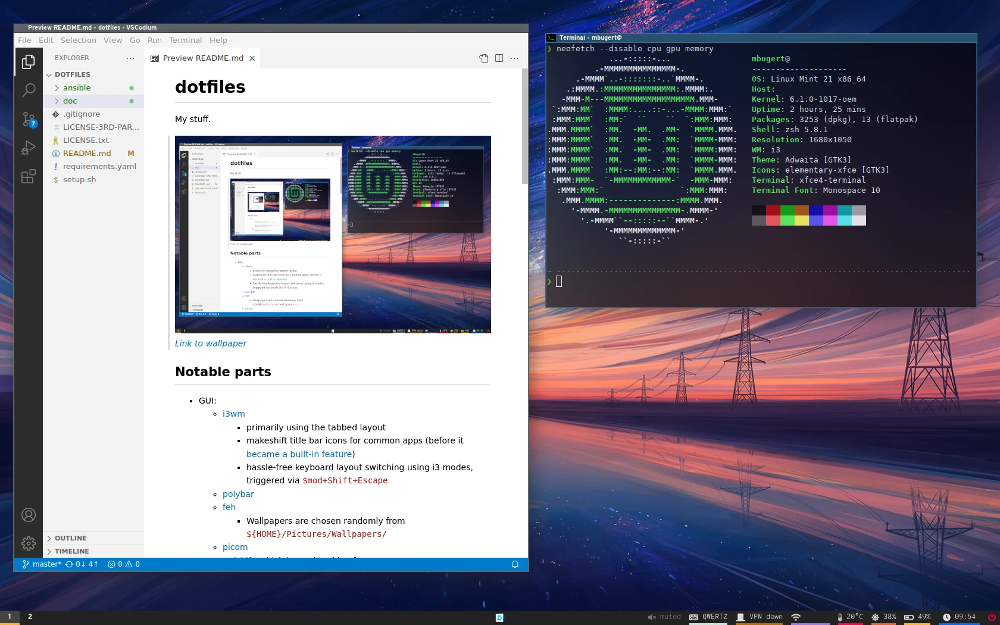

# dotfiles
My stuff.


_[Link to wallpaper](https://www.artstation.com/artwork/lx0BDk)_

## Notable parts
* GUI:
    * [i3wm](https://i3wm.org/)
        * primarily using the tabbed layout
        * makeshift title bar icons for common apps (before it [became a built-in feature](https://github.com/i3/i3/issues/905))
        * hassle-free keyboard layout switching using i3 modes, triggered via `$mod+Shift+Escape`
    * [polybar](https://github.com/polybar/polybar)
    * [feh](https://feh.finalrewind.org/)
        * Wallpapers are chosen randomly from `${HOME}/Pictures/Wallpapers/`
    * [picom](https://github.com/yshui/picom)
    * [redshift](https://github.com/jonls/redshift), which keeps breaking for some reason
    * [custom screen brightness controls](ansible/roles/dotfiles/files/scripts/screen_brightness.py):
        * minimum brightness goes as low as the hardware permits
        * brightness steps are exponential, for greater control over the low brightness region
        * can control laptop backlight (via ACPI) and external screens (via DDC/CI)
        * can specify screen luminance to make sure effective luminance is homogenous in multi-screen setups
    * [tailscale polybar integration and rofi menu](https://github.com/mbugert/tailscale-polybar-rofi)
    * [rofimoji](https://github.com/fdw/rofimoji) emoji picker
* CLI:
    * `zsh` with
        * [powerlevel10k](https://github.com/romkatv/powerlevel10k), lean style
        * [zsh-autosuggestions](https://github.com/zsh-users/zsh-autosuggestions)
        * [zsh-bd](https://github.com/Tarrasch/zsh-bd)

## Setup / Deployment
* Deployment is **automated** through Ansible (with exceptions).
* To support multiple devices, there are **device-specific tweaks** that are also deployed automatically: [setup.sh](setup.sh) puts `/var/lib/dbus/machine-id` into an env var that Ansible picks up to trigger device-specific [tasks](ansible/roles/dotfiles/tasks/main.yaml) and [config file inclusions](ansible/roles/dotfiles/tasks/device_specific.yaml).

Steps:
1. Have Debian/Ubuntu/Mint or Arch/Manjaro, and xfce4 desktop environment
2. Run:
   ```bash
   git clone https://github.com/mbugert/dotfiles ~/dotfiles
   cd ~/dotfiles
   ./setup.sh
   ```
   Options appended to `./setup.sh` are passed to `ansible-playbook`. For example, use `./setup.sh --tags cli` for headless systems.
3. Things like VSCodium, MiKTeX, and Synology Drive need to be set up manually. There are Ansible tasks that print reminders for doing that.

## Todo
* setup:
    * only change/check login shell if necessary
    * install all xfce4 desktop utilities
* more in-depth tests on Arch/Manjaro

## Notable tweaks
Obscure things I need to document for myself.

### Focus VSCodium before opening files
By default, if one has VSCodium/VSCode instances open on multiple i3 workspaces and opens a file through thunar, the last VSCodium instance which received focus will open the file, not an instance on the same workspace. This way, files tend to open off-screen for no good reason. [Video demonstration here](https://www.reddit.com/r/i3wm/comments/l28iol/how_to_always_use_vscodium_instance_from_current/).

This is fixed here by modifying [the VSCodium .desktop entry](.local/share/applications/codium.desktop) by wrapping it with [a script](mimeapps/.local/bin/focus_before_launch.sh) which tries to focus a VSCodium instance on the current workspace before opening a file.

### Possibility to use the menu key as i3 mod key
When in a full-screen remote desktop session where the local and remote system use the same i3 config, control over the local system is lost because the remote system eats all i3 `$mod+...` commands.
To resolve this, I like to use the menu key (the one between Alt Gr and right Ctrl) as an alternative mod key for i3. This key cannot be mapped in i3 out of the box (at least when I tried) so a custom keyboard layout definition is necessary, see [X11/usr/share/X11/xkb/symbols/mb](X11/usr/share/X11/xkb/symbols/mb).

References:
* Creating a custom keyboard layout: https://gist.github.com/nh2/ff15f412881f35ab7730
* More information on `xkb` configuration (very helpful): https://www.charvolant.org/doug/xkb/html/node5.html

## Inspiration
* exponential screen brightness: [Konrad Strack](https://konradstrack.ninja/blog/changing-screen-brightness-in-accordance-with-human-perception/)
* using i3 modes for switching keyboard layouts: [/u/grindhawk](https://www.reddit.com/r/i3wm/comments/51qvi3/switch_keyboard_layouts_with_i3/d7el0c6/)
* title bar icons: [github.com/dmelliot](https://gist.github.com/dmelliot/437924ff581f3f1edd59f44833be6cc6)
* for the idea of using Ansible for deployment: [github.com/elnappo](https://github.com/elnappo/dotfiles/)
